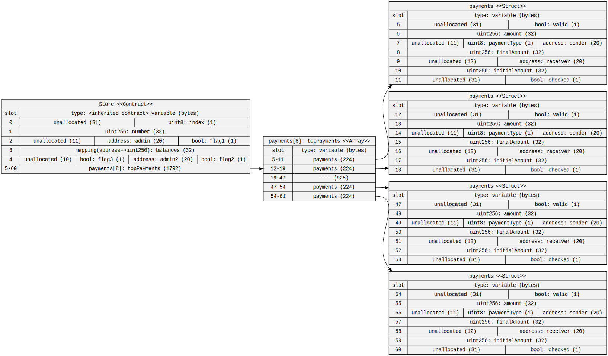
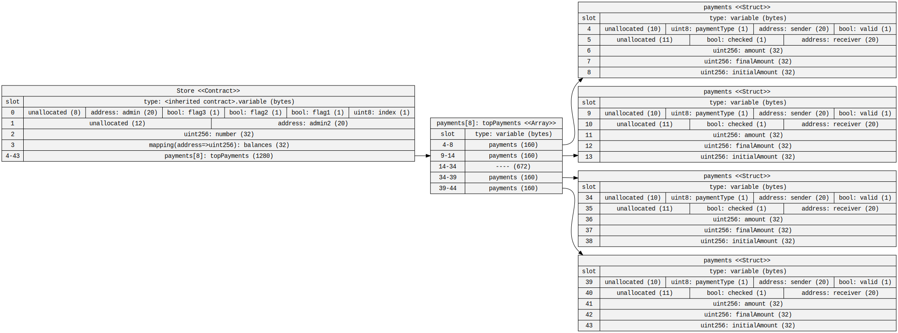

# Optimizing Storage

Take [this contract](https://gist.github.com/extropyCoder/6e9b5d5497b8ead54590e72382cdca24)
Use the [sol2uml tool](https://github.com/naddison36/sol2uml) to find out how many storage slots it is using.
By re ordering the variables, can you reduce the number of storage slots needed ?

## Solution

Before re ordering the variables the contract used 61 storage slots(0-60).

After packing the variables efficiently the contract uses 44 storage slots(0-43).

