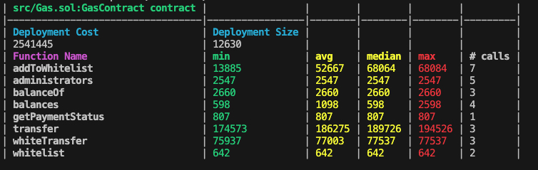
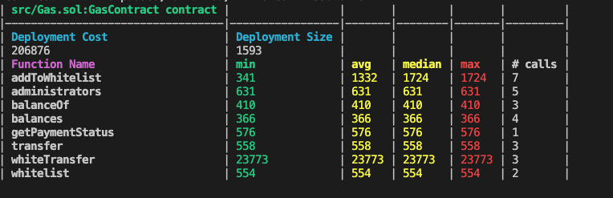

# Homework 8

## Gas optimization team game

This was a team activity, you can check our final results in this [repo](https://github.com/ggonzalez94/GasOptimisationFoundry/tree/gustavo)

These were the results.

Initial gas usage:

After running several rounds of optimizations and deleted plenty of unused code, these are the final results:

